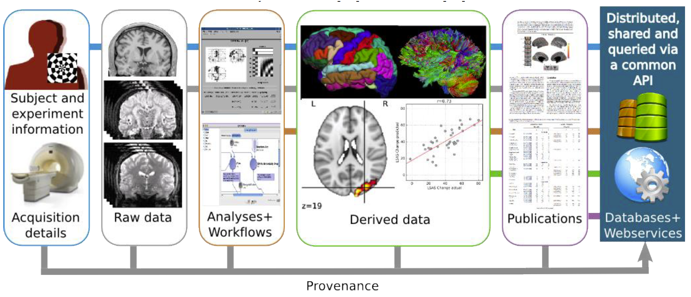

name: inverse
layout: true
class: center, middle, inverse
---
# Reproducible Research using ReproNIm
### Smruti Padhy, PhD
### Massachusetts Institute of Technology
### smruti@mit.edu
---
Many thanks to the ReproNIm team

[source](https://github.com/smpadhy/workshops/tree/gh-pages/2017-03-boston/lectures/repronim-overview)

Acknowledgement - NIH funding

---
layout: false
### Outline

- Reproducible Research

  - Definitions

  - Approaches so far

- ReproNIm - Overview

    - Project Goal

    - Data discovery

    - Data Modeling and Integration

    - Execution Environments

    - Training

- Summary

---
### Reproducible Research
- Original Experiment: Data  +  Analysis  =  Result

- A Neuroimaging Workflow

- Provenance is critical for reproducibility

---

### Definitions

- **Re-executability (Publication-level Replication)**

    - Exact Same Data + Exact Same Analysis should yield the Exact Same Result

    - Current publications do not actually provide complete specification

---
### Reproducible Research
- **Generalizable Reproducibility (GR)** across publications

--

    - (v1) Exact Same Data + Nominally ‘Similar’ Analyses should yield a ‘Similar’ Result

    - (v2) Nominally ‘Similar’ Data + Exact Same Analysis should yield a ‘Similar’ Result

    -  Nominally ‘Similar’ Data + Nominally ‘Similar’ Analyses should yield a ‘Similar’ Result

    - Dis-incentivize publication of replication studies as 'not novel’

    - With lack of precise characterization of data, analysis and results, ‘Similar’ has lots of wiggle room for interpretation (both to enhance similarity and discount differences)!

???
Notes:

---
### Information Needs to be Captured

- Data
- Parameters
- Environment
    - Hardware
    - Operating system
    - Software/libraries
- Code
- Output
- Requirements

---
### Approaches so far

- Collaboration and Data sharing
    - git
    - git annex
    - datalad
    - ...

- Execution environment through Virtualization technology
    - Virtual Machine
    - Docker
    - Singularity

- Capturing execution environment
    - reprozip

-  Workflows
    - nipype
    - ...

---
### Approaches so far

- Data models and Provenance tracking
    - NeuroImaging Data Model (NIDM)
    - ...

- Specification
    - BIDS
    - Common Workflow Language
    ...

---
### Motivation

There is a need for an *end-to-end* reproducible analysis framework that ‘bundles’

- complete study data

-  processing workflow

- execution environment

- statistical analysis and interpretations that arise from an analysis

???
Building blocks for such frameworks exist due to previous NIH efforts

---

### ReproNIm: A Center for Reproducible Neuroimaging Computation

“(Discover, Replicate, Innovate)^Repeat"

**Objective**
Develop and implement of suit of technologies for basic and clinical activities to support

- a comprehensive set of data management

- analysis

- utilization frameworks

- link between (neuroimaging data, analysis and results)

*It will be an end-to-end reproducible analysis framework towards improving reprodicibility!*

---
### ReproNIm Components

- Resource Discovery

- Data Models, Provenance and Integration

- Execution Environments

- Training

---

### Resource Discovery
- Key aspects of repeatable science - ability to **share** and **locate** data and software

**Objective**

- Assists end-user with specific analytic goal to find appropriate data and software which are subsequently submitted to the specified workflow and local/cloud-based execution envrionments.

--

**Current state**

- Existing Infastructures do not offer the automation necessary for rapid repeatable study

    - Community resource index and search envrionments (e.g. NIF)

    - Community data storage and computing resources (e.g., NITRC)

--

Ever increasing growth of neuroimaging data, software and analysis --> more sophisticated search and discovery algorithms and environment are needs to be developed !

---

### Resource Discovery - Approach

Creates a comprehensive environment that will
- integrate NIF data resources
- NITRC tools registry
- NITRC computational environment

Implement search, discovery and publish interfaces - Neuroimaging semantic framework

- Develop a recommendation system for the appropriate selection of data and tools for subsequent analysis

**NeuroBLAST**, a search engine that

- will allow users to find matching/similar studies based on a combination of task, analysis, and activation patterns

- Data discovered will be available for download through DataLad

???
Notes
- Neuroscience Information framework (NIF) and Neuroimaging Informatics Tools and Resources Clearinghouse (NITRC)

---
### Data Model, Provenance and Integration

Challenges in Brain Imaging research reproducibility

- Diverse brain imaging data
    - Clinical questionnaires, cognitive assessments, clinical and neuropsychological evaluations
    - genetic information, experimental paradigms,  physiological data
    - MRI, PET, EEG, MEG data

--

- Lacks standards and interoperability across databases

--

- Plethora of computational tools with little adherence to software engineering standards

--

- Challenges to linking data and computation
    - zipped file with description on a webpage
    - a database with specialized programmable API requiring human for interpretation
    - Lack of provenance of computation
    - absence of standard and well-defined vocabulary to describe objects and processes in brain imaging
    - lack of standardized provenance tracking tools in scientific software

--

Curation becomes time, consuming, resource intensive, error prone!
???
Notes:
How do you describe your data
BIDS gives file organization specification
---
### Data Model, Provenance and Integration
**Objective**
- To provide a consistent and extensible data model for communicating information in brain imaging, associated software tools, and to provide a set of commonly used reproducible workflows with integrated provenance tracking

---

### Data Model, Provenance and Integration - Approach
- Extend neuroimaging data model (NIDM)
    -  to capture different component of research activity (e.g. participants,software, hardware)
    - capture their relation in the model

- The components of the model
    - a structured terminology that provides semantic context to experimental data and workflow specification
    - a formal data model for neuroimaging results generated by brain imaging software (SPM, FSL and FreeSurfer)

- Components being developed - NIDM-Experiment, NIDM-Workflow

---

[**Neuroimaging Data Model (NIDM) Component Layers**](http://nidm.nidash.org)

???
notes
-

---
### **BrainVerse**

- Electronic Laboratory Notebook - As a desktop app for reproducible neuroimaging research

- Allows neuroimaging research to be carried out collaboratively

- Will support reuse/share of data, software and results

- Uses NIDM model
    - Curation of data and results happens at the source

    - Data saved locally or to a remote store with NIDM semantics

- Being developed using Electron framework, primarily written in Javascript

- Architected as web application as well so later on can be deployed as web service

- Will connect to NeuroBLAST and NICEMAN

---

### **Execution Environments**

- Reproducible analysis requires accessibility.
    - Software and tools be deployed in computing environments available to end users without technical system and software installation knowledge.
    -  Deployment needs to be well specified (e.g., exactly which tools are installed), automated (so it can be
reconstructed later on), and controlled (e.g., the environment is tested).

--

**Requirement**:
Full automation and tracking of computing environments

--

NeuroImaging Computational Environments MANager (**“NICEMAN”**)

--

It will **support**:
- easy and reproducible execution of neuroimaging analysis workflows
- various computational platforms
- efficient reuse and integration of existing free and open-source software products
- data distribution

---

It will **execute** the workflow by:
- automatically creating computation environments where necessary
- making sure software and datasets are available
- executing the workflow(s)
- providing results and detailed provenance information
about the environment back

--

*It will simplify creation and management of computing environments in Neuroimaging!*

???
Notes:
---
class: center
### ReproNIm - Overview

???
Notes
- (TRD1)Given a specific analysis task, this subproject will provide services for suggesting available data and software resources that are relevant, create a linked open data representation of these data, provide any available assessment metrics for these resources, and provide the available deployment/execution options available for these resources.
- (TRD2)
- (TRD3)
---
### Training

 **Objectives**:

 - To provide the brain imaging community with online training materials based on the concepts and software developed by the center.

- To conduct training workshops to teach the fundamentals of reproducible neuroimaging and to use center resources and tools effectively.

- To cultivate a clear understanding of the concepts, assumptions, and limitations underlying the reproducible research automation tools.

---
### Training - Approach

- Online materials being developed reuses already existing materials and new ones are created wherever required.

- Existing materials are being reviewed before adding to the online traning resources

- Training modules are shared through github

- Assesments/Assignments are being designed for a user taking the online materials

- Training Modules can be found here in [gitHub](https://github.com/ReproNim) or on [here](http://www.reproducibleimaging.org/module-reproducible-basics/)

---
### Summary
ReproNIm provides four components

- Resourcey Discovery: To search neuroimaging data, software, workflows through **NeuroBLAST**

- Data Model, Provenance and Integration: Describe your data using NIDM and **Brainverse**

- Execution Environments - Automation and tracking of execution environment through **NICEMAN**

- Training - Online training material resources for concepts and technologies for reproducible neuroimaging reseach

Use your tools how you want, but make the results reproducible, open and persistent with ReproNIm: “(Discover, Replicate, Innovate)^Repeat”!
---
class: center, middle
## Thank you
---
class: center, middle
## Questions?
