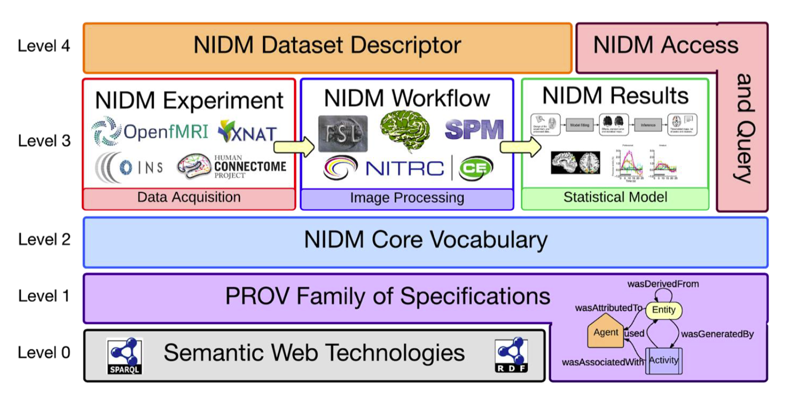
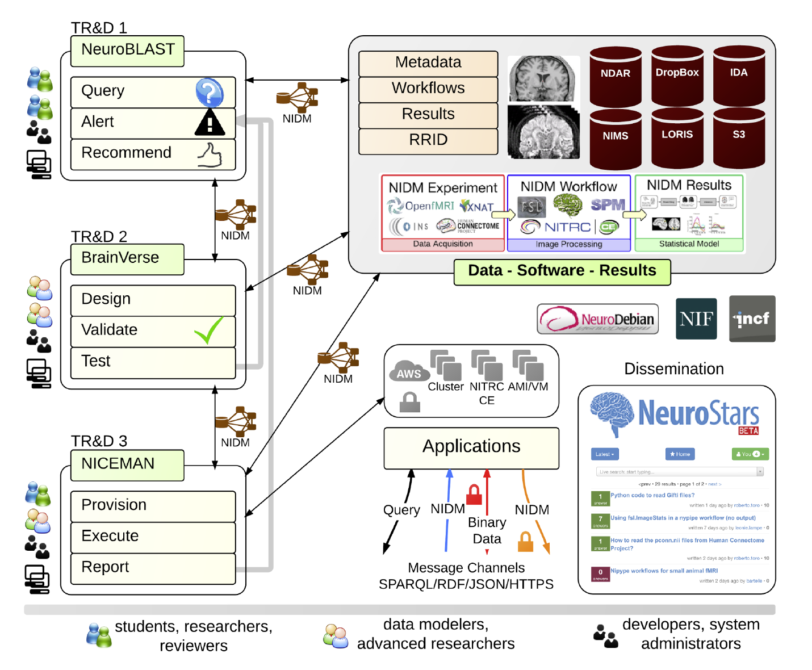

name: inverse
layout: true
class: center, middle, inverse
---
# Reproducible Research using ReproNIm
### smruti@mit.edu
---
Many thanks to the ReproNIm team

[source](https://github.com/smpadhy/repronim-ppt/tree/gh-pages) | CC-BY

(You can update this presentation - just send a pull-request)

Acknowledgement - NIH funding
---
layout: false
### Outline

- Reproducible Research

  - Definition

  - Approaches so far

- ReproNIm

    - Project Goal

    - Data discovery

    - Data Modeling and Integration

    - Execution Environments

- Example

- Summary

---
### Reproducible Research
- Original Experiment: Data  +  Analysis  =  Result

- Provenance critical for reproducibility

--

- **Re-executability (Publication-level Replication)**

    - Exact Same Data + Exact Same Analysis should yield the Exact Same Result
    -
    - Problem since current publications do not actually provide complete specification

---
### Reproducible Research
- **Generalizable Reproducibility (GR)** across publications

--

    - (v1) Exact Same Data + Nominally ‘Similar’ Analyses should yield a ‘Similar’ Result (i.e. FreeSurfer subcortical volumes compared to FSL FIRST)

    - (v2) Nominally ‘Similar’ Data + Exact Same Analysis should yield a ‘Similar’ Result (e.g. my kids with autism compared to your kids with autism)

    -  Nominally ‘Similar’ Data + Nominally ‘Similar’ Analyses should yield a ‘Similar’ Result

    - Huge problem since we dis-incentivize publication of replication studies as 'not novel’

    - With lack of precise characterization of data, analysis and results, ‘Similar’ has lots of wiggle room for interpretation (both to enhance similarity and discount differences)!

???
Notes:

---
### Issues that affect Reproducibility
- Low power
- Mistakes
- Ineffective Data Sharing
- Methodological Variance
- Sampling
- P – hacking (P-phishing)
- Publication Bias
- Only reporting potentially significant results, and not the rest

???
Not sure of this slide
---

### Approaches so far

- Data sharing through different infrastructure

- Execution environment through Containers/Virtual Machines

- Saving and sharing workflows

- Data models and Provenance tracking

--

Requires an *end-to-end* reproducible analysis framework that ‘bundles’

    - complete study data

    - processing workflow

    - execution environment

    - statistical analysis and interpretations that arise from an analysis

???
Building blocks for such frameworks exist due to previous NIH efforts
---

### ReproNIm - Overview
- Center for Reproducible Neuroimagimg Computation

- “(Discover, Replicate, Innovate)^Repeat"

- Team science approach to implementing the link between (neuroimaging data, analysis and results)

- Builds  end-to-end reproducible analysis framework and provides software stack toward achieving this

---
### Resource Discovery
- Key aspects of repeatable science - ability to **share** and **locate** data and software

**Requirement**

- Assists end-user with specific analytic goal to find appropriate data and software which are subsequently submitted to the specified workflow and local/cloud-based execution envrionments.

--

**Current state**

- Existing Infastructures do not offer the automation necessary for rapid repeatable study
    - Community resource index and search envrionments (e.g. NIF)
    - Community data storage and computing resources (e.g., NITRC)

--

- With ever increasing growth of data, software and analysis in neuroimaging, more sophisticated search and discovery algorithms and environment are required !

---

### Resource Discovery - Approach
- Create an comphrensive environment that integrates NIF data resources and services with NITRC tools registry and computational environment

- Implement search, discovery and publich interfaces through enhancement of neuroimaging semantic framework

- Develop a recommendation system for the appropriate selection of data and tools for subsequent analysis

- **NeuroBLAST**, a search engine that

    - allows users to find matching/similar studies based on a combination of task, analysis, and activation patterns

- Data discovered will be available for download through DataLad

???
Notes
- Neuroscience Information framework (NIF) and Neuroimaging Informatics Tools and Resources Clearinghouse (NITRC)

---
### Data Model, Provenance and Integration

Challenges in Brain Imaging research reproducibility

- Diverse brain imaging data
    - Clinical questionnaires, cognitive assessments, clinical and neuropsychological evaluations
    - genetic information, experimental paradigms,  physiological data
    - MRI, PET, EEG, MEG data

--

- Lacks standards and interoperability across databases

--

- Plethora of computational tools with little adherence to software engineering standards

--

- Challenges to linking data and computation
    - zipped file with description on a webpage
    - a database with specialized programmable API requiring human for interpretation
    - Lack of provenance of computation
    - absence of standard and well-defined vocabulary to describe objects and processes in brain imaging
    - lack of standardized provenance tracking tools in scientific software

--

Curation becomes time, consuming, resource intensive, error prone!
???
Notes:

---
### Data Model, Provenance and Integration
**Requirement**
- Provide a consistent and extensible data model for communicating information in brain imaging, associated software tools, and to provide a set of commonly used reproducible workflows with integrated provenance tracking

---

### Data Model, Provenance and Integration - Approach
- Extending neuroimaging data model (NIDM) to capture different component of research activity (e.g. participants,software, hardware ) and their relation in the model that includes activities that transform data.

- The components of the model
    - a structured terminology that provides semantic context to experimental data
    - a formal data model for neuroimaging results generated by brain imaging software (SPM, FSL and FreeSurfer)

- Components being developed - NIDM-Experiment, NIDM-Workflow

---

[**Neuroimaging Data Model (NIDM)**](http://nidm.nidash.org)

???
notes
-

---
### **BrainVerse**
- Electronic Laboratory Notebook - As a desktop app for reproducible neuroimaging research

- Allows neuroimaging research to be carried out collaboratively

- Will support reuse/share of data, software and results

- Uses NIDM model
    - Curation of data and results happens at the source

    - Data saved locally or to a remote store with NIDM semantics

- Being developed using Electron framework, primarily written in Javascript

- Architected as web application as well so later on can be deployed as web service

- Will connect to NeuroBLAST and NICEMAN

---

### **Execution Environments**

- Reproducible analysis requires accessibility.
    - Software and tools be deployed in computing environments available to end users without technical system and software installation knowledge.
    -  Deployment needs to be well specified (e.g., exactly which tools are installed), automated (so it can be
reconstructed later on), and controlled (e.g., the environment is tested).

--

**Requires**:
Full automation and tracking of computing environments

--

NeuroImaging Computational Environments MANager (**“NICEMAN”**)

--

It **supports**:
- easy and reproducible execution of neuroimaging analysis workflows
- various computational platforms
- efficient reuse and integration of existing free and open-source software products
- provides data sharing initiatives

---

**Executes** the workflow by:
- automatically creating computation environments where necessary
- making sure software and datasets are available
- executing the workflow(s)
- providing results and detailed provenance information
about the environment back

--

*Simplifies creation and management of computing environments in Neuroimaging!*

???
Notes:
---
class: center
### ReproNIm - Overview

???
Notes
- (TRD1)Given a specific analysis task, this subproject will provide services for suggesting available data and software resources that are relevant, create a linked open data representation of these data, provide any available assessment metrics for these resources, and provide the available deployment/execution options available for these resources.
- (TRD2)
- (TRD3)
---
### Example

---
### Summary

Use your tools how you want, but make the results reproducible, open and persistent with ReproNIm: “(Discover, Replicate, Innovate)^Repeat”!
---
class: center, middle
## Thank you
---
class: center, middle
## Questions?
